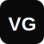

<!-- VG PORTFOLIO README -->
<div align="center">
  
  <h1>VG Portfolio</h1>
  <p><strong>A modern, high-performance, and deeply interactive 3D web portfolio.</strong></p>

  <a href="https://github.com/vivek-gorantla2005/vivek-portfolio">
    
  </a>
  
  
  
</div>

<br />

## 🌠 Unmatched Visual Aesthetic
This portfolio was built to break away from traditional boring layouts, adopting a highly atmospheric **cinematic styling**. Combining depth, motion, floating environments, and neon glowing accents into a seamless React-driven single-page application.

## 🚀 Key Features
- **Cinematic 3D Hero Scene**: Rendered via `@react-three/fiber`, featuring a glowing grid matrix and floating code syntax elements.
- **Buttery Smooth Scrolling**: Implements `Lenis` smooth scroll for high-end native-feeling browser navigation.
- **Dynamic Marquee Showcase**: Fully animated, edge-faded moving grids with hover-to-color tech stack SVGs.
- **Performant Video Rendering**: Project sections use auto-playing `<video>` elements with native controls for heavy multimedia handling.
- **Glassmorphism & Neon Design**: Blurring backdrops, `-webkit-text-stroke` dynamic outlines, and smart CSS variables for precise `Light` and `Dark` theme swapping.

## 🛠 Tech Stack
- **Framework**: [React](https://reactjs.org/) + [Vite](https://vitejs.dev/)
- **Language**: [TypeScript](https://www.typescriptlang.org/)
- **3D & Canvas**: [React Three Fiber](https://docs.pmnd.rs/react-three-fiber/getting-started/introduction) + [Three.js](https://threejs.org/)
- **Animations**: [GSAP](https://gsap.com/) + [Framer Motion](https://www.framer.com/motion/)
- **Styling**: Vanilla CSS Modules (Variables & Design Tokens)

## 📦 Getting Started

### Prerequisites
Make sure you have Node.js installed to run this project.

### Installation & Run
1. Clone the repository:
   ```bash
   git clone https://github.com/vivek-gorantla2005/vivek-portfolio.git
   ```
2. Navigate to the project directory:
   ```bash
   cd vivek-portfolio/personalportfolio-v1
   ```
3. Install dependencies:
   ```bash
   npm install
   ```
4. Start the local development server:
   ```bash
   npm run dev
   ```

## 👨‍💻 Developed By
**Vivek Gorantla**  
- GitHub: [@vivek-gorantla2005](https://github.com/vivek-gorantla2005)
- LinkedIn: [Vivek Gorantla](https://www.linkedin.com/in/vivek-gorantla/)

---
*Built with passion, caffeine, and modern web tech. ☕*
